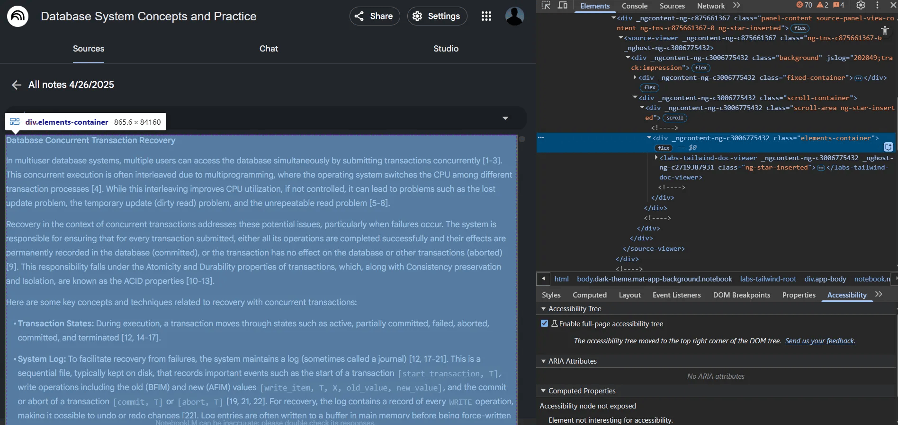
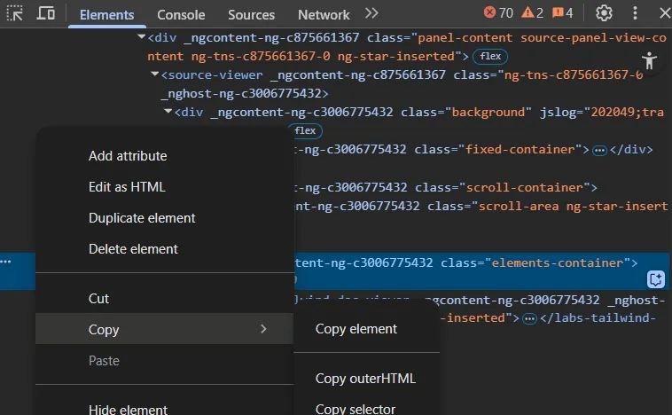

# notebooklm_notes2md

A Python script to convert HTML-formatted notes (from Google NotebookLM) into Markdown and export them as a single PDF or Markdown file. The script parses the HTML input, extracts note sections, and generates a formatted output file.

---

**Table of Content**

- [1. Why This Script?](#1-why-this-script)
- [2. How to Export Your Notes from NotebookLM](#2-how-to-export-your-notes-from-notebooklm)
- [3. Requirements](#3-requirements)
- [4. Installation](#4-installation)
  - [4.1. Using pip (from PyPI)](#41-using-pip-from-pypi)
  - [4.2. Using pip (from GitHub)](#42-using-pip-from-github)
  - [4.3. Manual Installation](#43-manual-installation)
  - [4.4. Development Installation](#44-development-installation)
- [5. Usage](#5-usage)
  - [5.1. Format Options](#51-format-options)
- [6. Output Example](#6-output-example)
- [7. Notes](#7-notes)
  - [7.1. Metadata Extraction](#71-metadata-extraction)
  - [7.2. Obsidian Format](#72-obsidian-format)
  - [7.3. Roadmap](#73-roadmap)
- [8. License](#8-license)
- [9. Contributing](#9-contributing)
- [10. Development](#10-development)
  - [10.1. Running Tests](#101-running-tests)
  - [10.2. Code Quality](#102-code-quality)
  - [10.3. Examples](#103-examples)

---

## 1. Why This Script?

Google’s NotebookLM is a powerful tool for interacting with your documents and taking notes. However, exporting your saved notes is not straightforward:

- There is no export option in the app itself.
- The only official way to get your notes is by downloading them all at once, which dumps everything into a single file, ruining the structure and formatting.

This script solves the problem by:

- Parsing the raw HTML structure from the downloaded notes
- Extracting metadata like summaries and key topics
- Converting each note into clean, readable Markdown
- Supporting Obsidian-compatible formatting with YAML frontmatter
- Exporting the notes to either a single PDF or Markdown file

---

## 2. How to Export Your Notes from NotebookLM

1. **Open your NotebookLM notebook.**
2. In the Studio section, find the option to **Convert all notes to source**.
3. This creates a new file in your sources section. You need to get the HTML source of this file:
   - Press `F12` or right-click and select **Inspect** to open your browser’s DevTools.
   - Use the **Select Element** tool (top-left in DevTools) and hover over the notes section.
   - Find the `<div>` with class `elements-container` (or similar) that contains your notes.
   - Right-click this element and choose **Copy > Copy element**.

   

4. Paste the copied HTML into a text file (you can name it anything, e.g., `notes.txt`).

   

> **Tip:** For screenshots and a visual walkthrough, see the original [Medium article](https://vivekhere.medium.com/how-to-export-google-notebooklm-saved-notes-as-pdf-10b5ce6c6c10).

---

## 3. Requirements

- Python 3.12
- [uv](https://github.com/astral-sh/uv) (for fast virtual environment and package management)

## 4. Installation

### 4.1. Using pip (from PyPI)

```bash
# Coming soon!
pip install notebooklm-notes2md
```

### 4.2. Using pip (from GitHub)

```bash
pip install git+https://github.com/zarzouram/notebooklm_notes2md.git
```

### 4.3. Manual Installation

#### Using uv (Recommended)

1. **Clone the repository:**

   ```bash
   git clone https://github.com/zarzouram/notebooklm_notes2md.git
   cd notebooklm_notes2md
   ```

2. **Create and activate a virtual environment using uv:**

   ```bash
   uv venv nblm_notes_cov --python=3.12
   source nblm_notes_cov/bin/activate
   ```

3. **Install dependencies:**

   ```bash
   uv pip install beautifulsoup4==4.13.4 markdown_pdf==1.7
   ```

#### Using pip

1. **Clone the repository:**

   ```bash
   git clone https://github.com/zarzouram/notebooklm_notes2md.git
   cd notebooklm_notes2md
   ```

2. **Create and activate a virtual environment:**

   ```bash
   python -m venv venv
   source venv/bin/activate  # On Windows: venv\Scripts\activate
   ```

3. **Install dependencies:**

   ```bash
   pip install -r requirements.txt
   ```

### 4.4. Development Installation

For development, install the package in editable mode:

```bash
pip install -e .
```

## 5. Usage

1. Place your HTML-formatted notes in a text file (with any file name).
2. Run the script with input and output file paths:

   ```bash
   # If installed via pip
   notebooklm-export <input_path> <output_path> [--format FORMAT]

   # OR directly using the script
   python notebooklm_export.py <input_path> <output_path> [--format FORMAT]
   ```

   For example:

   ```bash
   # Export to PDF
   notebooklm-export my_notes_html.txt my_notes.pdf

   # Export to standard Markdown
   notebooklm-export my_notes_html.txt my_notes.md

   # Export to Obsidian-compatible Markdown
   notebooklm-export my_notes_html.txt my_notes.md --format obsidian
   ```

3. The script will generate a single PDF or Markdown file containing all your notes.

### 5.1. Format Options

- `standard` (default): Basic Markdown format
- `obsidian`: Obsidian-compatible Markdown with YAML frontmatter, including:
  - Document title and extracted tags (with special formatting for Obsidian compatibility):
    - Spaces converted to hyphens
    - Special characters removed
    - Tags starting with numbers prefixed with 't'
  - Summary formatted as a callout block
  - Citation placeholders (`citekey` and `status` fields)

---

## 6. Output Example

- The output preserves Markdown formatting, including headings, bullet lists, and code blocks.
- PDF output includes proper formatting and is easy to read.
- Markdown output maintains the original structure for further editing.
- The output is clean and ready for archiving, searching, or sharing.

---

## 7. Notes

- The script expects the notes to be wrapped in a `<labs-tailwind-doc-viewer>` or similar tag in the HTML. Adjust the script if your HTML structure differs.
- All notes are combined into a single output file (PDF or Markdown).
- The script preserves formatting including headings, bullet lists, and code blocks.
- Metadata extraction works best with the latest NotebookLM HTML format.
- Obsidian format includes YAML frontmatter with citation placeholders that can be manually edited.
- For more details, troubleshooting, and screenshots, refer to the [original Medium article](https://vivekhere.medium.com/how-to-export-google-notebooklm-saved-notes-as-pdf-10b5ce6c6c10).

### 7.1. Metadata Extraction

The tool extracts the following metadata from NotebookLM HTML:

- **Document Title**: The title of the NotebookLM document
- **Summary**: The AI-generated summary of the content
- **Key Topics/Tags**: The key topics identified by NotebookLM

This metadata is preserved in the Obsidian export format as YAML frontmatter and in the content structure.

### 7.2. Obsidian Format

The Obsidian export format includes:

- **YAML Frontmatter**: With title, tags, date, and citation placeholders
- **Summary Callout**: The extracted summary formatted as an Obsidian callout
- **Document Content**: The notes formatted as Markdown

For more details, see the [Obsidian Format Documentation](docs/obsidian_format.md).

### 7.3. Roadmap

For information about planned features and development progress, see the [ROADMAP.md](docs/ROADMAP.md) file.

---

## 8. License

MIT License

## 9. Contributing

Contributions are welcome! Here's how you can contribute:

1. Fork the repository
2. Create a feature branch (`git checkout -b feature/amazing-feature`)
3. Commit your changes (`git commit -m 'Add some amazing feature'`)
4. Push to the branch (`git push origin feature/amazing-feature`)
5. Open a Pull Request

For major changes, please open an issue first to discuss what you would like to change.

## 10. Development

### 10.1. Running Tests

Run the test suite using pytest:

```bash
# Install test dependencies
pip install pytest

# Run tests
pytest
```

### 10.2. Code Quality

Ensure code quality with:

```bash
# Install linting tools
pip install flake8 mypy
```

### 10.3. Examples

The repository includes example scripts demonstrating how to use the package programmatically:

- **[examples/obsidian_export.py](examples/obsidian_export.py)**: Shows how to extract metadata and format notes as Obsidian markdown.
- **[examples/custom_formatter.py](examples/custom_formatter.py)**: Demonstrates creating a custom formatter for academic publishing.
